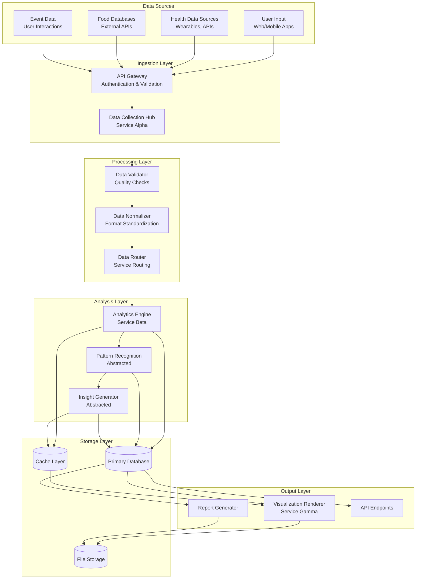
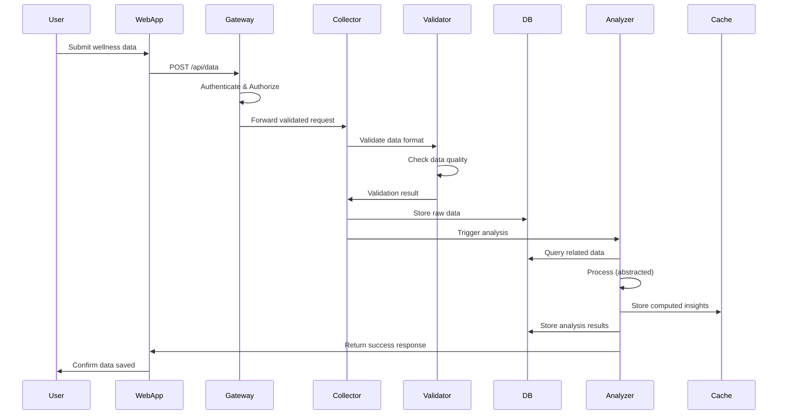
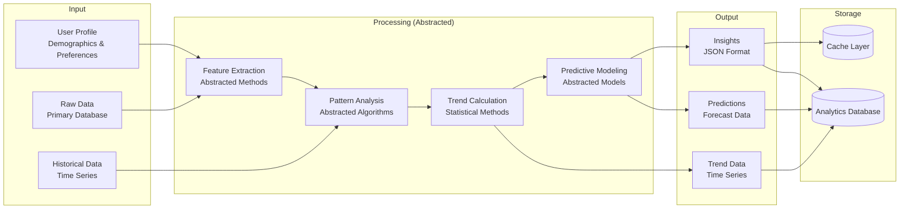
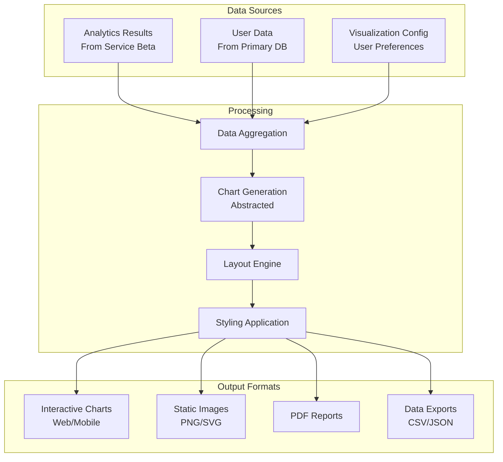
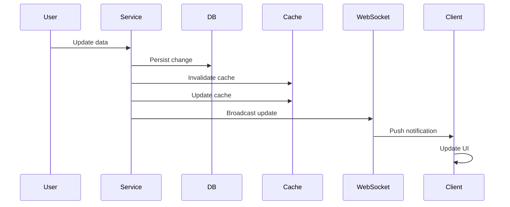
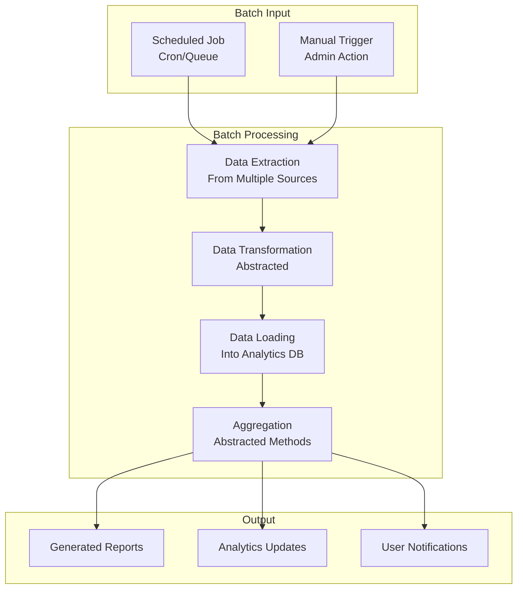
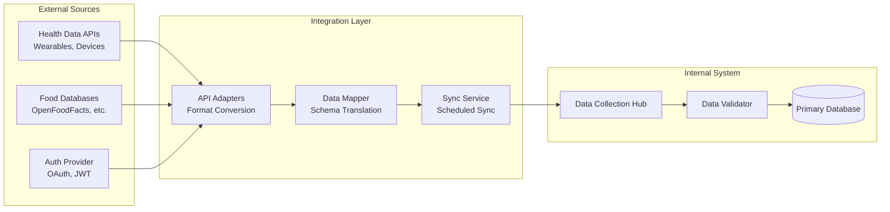
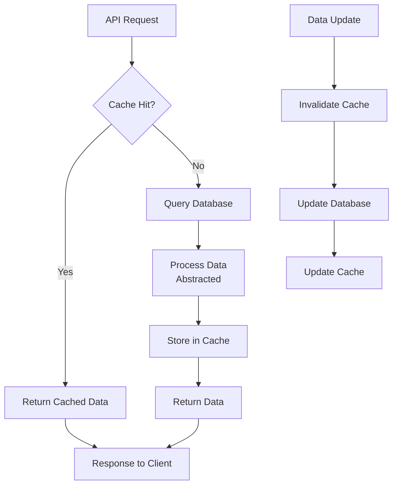
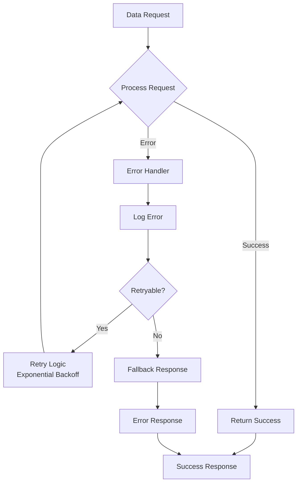

# Data Flow Diagrams

This document illustrates how data flows through the system using abstracted service descriptions. All proprietary processing logic is abstracted to protect trade secrets.

## High-Level Data Flow

## Detailed Data Flow: User Data Collection

## Data Flow: Analytics Processing

## Data Flow: Visualization Generation

## Data Flow: Real-Time Updates

## Data Flow: Batch Processing

## Data Flow: External Integration

## Data Flow: Caching Strategy

## Data Flow: Error Handling & Recovery

---

## Data Flow Principles

### 1. Unidirectional Flow
Data flows in a single direction through the system to maintain predictability and debuggability.

### 2. Validation at Entry Points
All data is validated at the API Gateway before entering the system.

### 3. Immutability Where Possible
Data is treated as immutable once stored, with new versions created for updates.

### 4. Event-Driven Updates
Real-time updates are propagated through event-driven architecture patterns.

### 5. Caching Strategy
Frequently accessed data is cached to improve performance and reduce database load.

### 6. Error Recovery
Robust error handling ensures system resilience and data integrity.

---

**Last Updated**: 2025-01-XX
**Status**: Active Development
