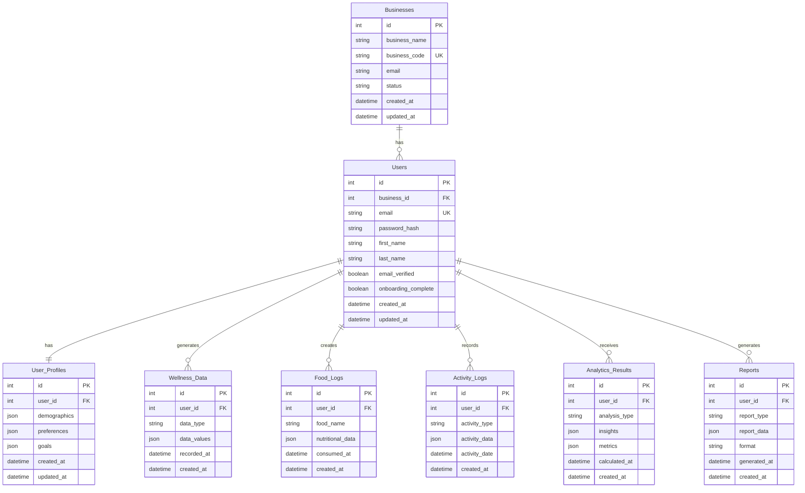

# Database Schema

This document provides a high-level overview of the database schema structure. Proprietary business logic, algorithms, and computation details are abstracted to protect trade secrets.

## Schema Overview

The database follows a relational model with clear separation of concerns across different domains. The schema supports multi-tenancy, user management, and various data product requirements.

## Core Tables

### Businesses
Represents business/organization entities (SaaS clients).

**Key Fields**:
- `id`: Primary key
- `business_name`: Organization name
- `business_code`: Unique business identifier
- `email`: Business contact email
- `status`: Active/Inactive status

**Relationships**:
- One-to-many with Users
- Supports multi-tenancy architecture

---

### Users
Represents individual users (consumers) within the system.

**Key Fields**:
- `id`: Primary key
- `business_id`: Foreign key to Businesses (nullable for direct consumers)
- `email`: Unique user email
- `password_hash`: Encrypted password
- `email_verified`: Email verification status
- `onboarding_complete`: Onboarding completion flag

**Relationships**:
- Many-to-one with Businesses
- One-to-one with User_Profiles
- One-to-many with all data collection tables

---

### User_Profiles
Extended user profile information.

**Key Fields**:
- `id`: Primary key
- `user_id`: Foreign key to Users
- `demographics`: JSON field for demographic data
- `preferences`: JSON field for user preferences
- `goals`: JSON field for user goals

**Note**: JSON fields allow flexibility while maintaining schema structure. Specific fields within JSON are abstracted.

---

## Data Collection Tables

### Wellness_Data
Stores various types of wellness tracking data.

**Key Fields**:
- `id`: Primary key
- `user_id`: Foreign key to Users
- `data_type`: Type of wellness data (hydration, sleep, etc.)
- `data_values`: JSON field containing actual data values
- `recorded_at`: When the data was recorded

**Purpose**: Flexible storage for various wellness metrics without exposing proprietary data structures.

---

### Food_Logs
Stores food consumption data.

**Key Fields**:
- `id`: Primary key
- `user_id`: Foreign key to Users
- `food_name`: Name of the food item
- `nutritional_data`: JSON field with nutritional information
- `consumed_at`: When the food was consumed

**Purpose**: Tracks food intake for nutritional analysis (proprietary analysis logic not exposed).

---

### Activity_Logs
Stores physical activity and exercise data.

**Key Fields**:
- `id`: Primary key
- `user_id`: Foreign key to Users
- `activity_type`: Type of activity
- `activity_data`: JSON field with activity details
- `activity_date`: Date of the activity

**Purpose**: Tracks physical activity for wellness analysis.

---

## Analytics & Insights Tables

### Analytics_Results
Stores computed analytics and insights.

**Key Fields**:
- `id`: Primary key
- `user_id`: Foreign key to Users
- `analysis_type`: Type of analysis performed
- `insights`: JSON field with insight data
- `metrics`: JSON field with calculated metrics
- `calculated_at`: When the analysis was performed

**Purpose**: Stores results of analytics processing. Specific algorithms and computation methods are abstracted.

**Note**: This table stores results only. The actual computation logic is proprietary and not documented here.

---

### Reports
Stores generated reports and visualizations.

**Key Fields**:
- `id`: Primary key
- `user_id`: Foreign key to Users
- `report_type`: Type of report generated
- `report_data`: JSON field with report content
- `format`: Report format (PDF, HTML, etc.)
- `generated_at`: When the report was generated

**Purpose**: Stores generated reports for user access and download.

---

## Additional Schema Components (Abstracted)

### Indexes
- Primary keys on all `id` fields
- Foreign key indexes on all `FK` fields
- Unique indexes on `email` and `business_code` fields
- Composite indexes for common query patterns (abstracted)

### Constraints
- Foreign key constraints for referential integrity
- Unique constraints on email and business_code
- Check constraints for data validation (abstracted)

### Views (Abstracted)
- Materialized views for common analytics queries
- Views for data aggregation and reporting
- Views for performance optimization

---

## Data Relationships Summary

### One-to-Many Relationships
- Businesses → Users
- Users → Wellness_Data
- Users → Food_Logs
- Users → Activity_Logs
- Users → Analytics_Results
- Users → Reports

### One-to-One Relationships
- Users → User_Profiles

### Many-to-Many Relationships
- (Abstracted - not shown to protect proprietary relationships)

---

## Database Design Principles

### 1. Normalization
- Third normal form (3NF) where appropriate
- Strategic denormalization for performance (abstracted)

### 2. Flexibility
- JSON fields for extensible data structures
- Schema evolution support
- Backward compatibility considerations

### 3. Performance
- Appropriate indexing strategy
- Query optimization (abstracted)
- Caching considerations

### 4. Security
- Encrypted sensitive fields
- Access control at database level
- Audit logging (abstracted)

### 5. Scalability
- Partitioning strategy (abstracted)
- Read replica support
- Horizontal scaling considerations

---

## Data Migration Strategy

### Version Control
- Schema versioning system
- Migration scripts for schema changes
- Rollback capabilities

### Backward Compatibility
- Deprecated fields maintained for compatibility
- Gradual migration paths
- Data transformation scripts

---

## Database Technology

### Development
- **SQLite**: Lightweight database for local development
- **File-based**: Easy setup and portability

### Production
- **PostgreSQL**: Robust relational database
- **ACID Compliance**: Data integrity guarantees
- **Extensibility**: JSON support and custom functions

### Caching
- **Redis**: In-memory caching layer
- **Cache Invalidation**: Smart invalidation strategies
- **Performance**: Sub-millisecond response times

---

## Data Privacy & Compliance

### Data Protection
- Encryption at rest
- Encryption in transit
- Access control and audit logging

### Compliance
- GDPR considerations
- Data retention policies
- User data export capabilities

### Anonymization
- Data anonymization for analytics (abstracted)
- Privacy-preserving analytics methods (abstracted)

---

**Last Updated**: 2025-01-XX
**Status**: Active Development

**Note**: This schema overview is abstracted to protect proprietary business logic, algorithms, and data processing methods. Specific field details within JSON columns, computation logic, and advanced features are not disclosed.
