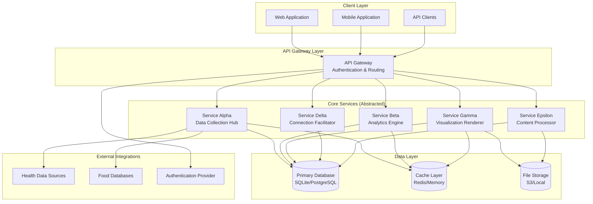

# System Architecture

This document provides a high-level overview of the system architecture using abstracted service descriptions. Services are represented as analogies/metaphors to protect proprietary information while demonstrating architectural patterns.

## Architecture Overview

The platform follows a microservices architecture pattern with clear separation of concerns, enabling scalability, maintainability, and independent deployment of services.

## Service Descriptions (Abstracted)

### Service Alpha: Data Collection Hub
**Analogy**: A "Lighthouse Keeper" that continuously monitors and collects data from multiple sources.

**Purpose**: 
- Aggregates data from various input sources
- Validates and normalizes incoming data
- Routes data to appropriate processing services
- Manages data quality and completeness

**Key Capabilities**:
- Multi-source data ingestion
- Data validation and quality checks
- Real-time data streaming
- Batch data processing

**No Proprietary Details**: Algorithm specifics, scoring mechanisms, or internal processing logic are not exposed.

---

### Service Beta: Analytics Engine
**Analogy**: A "Pattern Weaver" that identifies trends and insights from collected data.

**Purpose**:
- Performs data analysis and pattern recognition
- Generates insights and recommendations
- Creates predictive models (abstracted)
- Produces analytics reports

**Key Capabilities**:
- Trend analysis
- Pattern recognition
- Statistical analysis
- Report generation

**No Proprietary Details**: Specific algorithms, model weights, or computation methods are not disclosed.

---

### Service Gamma: Visualization Renderer
**Analogy**: A "Storyteller" that transforms data into visual narratives.

**Purpose**:
- Creates interactive visualizations
- Generates customizable reports
- Renders dashboards and charts
- Exports data in various formats

**Key Capabilities**:
- Chart generation
- Dashboard rendering
- Report templating
- Data export (PDF, CSV, JSON)

**No Proprietary Details**: Rendering algorithms or visualization techniques are abstracted.

---

### Service Delta: Connection Facilitator
**Analogy**: A "Community Bridge" that connects like-minded individuals.

**Purpose**:
- Facilitates user connections
- Manages event-based interactions
- Handles matching processes (abstracted)
- Tracks engagement metrics

**Key Capabilities**:
- User matching (abstracted algorithm)
- Event management
- Community analytics
- Engagement tracking

**No Proprietary Details**: Matching algorithms, scoring mechanisms, or proprietary logic are not exposed.

---

### Service Epsilon: Content Processor
**Analogy**: A "Knowledge Librarian" that organizes and processes content.

**Purpose**:
- Processes and categorizes content
- Manages content relationships
- Handles content search and retrieval
- Maintains content metadata

**Key Capabilities**:
- Content indexing
- Search functionality
- Content relationships
- Metadata management

**No Proprietary Details**: Processing algorithms or categorization logic are abstracted.

---

## Architecture Patterns

### Microservices Pattern
- **Independent Deployment**: Each service can be deployed independently
- **Technology Diversity**: Services can use different technologies as needed
- **Scalability**: Services scale independently based on demand
- **Fault Isolation**: Failures in one service don't cascade to others

### API Gateway Pattern
- **Single Entry Point**: All client requests go through the gateway
- **Authentication**: Centralized authentication and authorization
- **Routing**: Intelligent request routing to appropriate services
- **Rate Limiting**: Protects services from overload

### Database per Service Pattern
- **Data Isolation**: Each service manages its own data
- **Independent Scaling**: Database scaling is service-specific
- **Technology Choice**: Services can choose appropriate database technology
- **Data Consistency**: Eventual consistency through service communication

### Caching Strategy
- **Multi-Level Caching**: Application-level and database-level caching
- **Cache Invalidation**: Smart cache invalidation strategies
- **Performance Optimization**: Reduces database load and improves response times

---

## Communication Patterns

### Synchronous Communication
- **REST APIs**: HTTP-based RESTful APIs for request-response patterns
- **GraphQL**: Flexible querying for complex data requirements
- **Response Times**: <2 second average response time target

### Asynchronous Communication
- **Event-Driven**: Services communicate through events
- **Message Queues**: For reliable asynchronous processing
- **Event Sourcing**: For audit trails and data history

---

## Scalability Considerations

### Horizontal Scaling
- Services are stateless where possible
- Load balancing across multiple service instances
- Database read replicas for read-heavy workloads

### Vertical Scaling
- Resource optimization per service
- Database optimization for specific workloads
- Caching strategies to reduce resource usage

---

## Security Architecture

### Authentication & Authorization
- **OAuth 2.0 / JWT**: Token-based authentication
- **Role-Based Access Control (RBAC)**: Granular permission management
- **API Key Management**: For service-to-service communication

### Data Security
- **Encryption at Rest**: Database encryption
- **Encryption in Transit**: TLS/SSL for all communications
- **Data Privacy**: Compliance with data protection regulations

### Network Security
- **API Gateway**: Single point of entry with security controls
- **Service Isolation**: Network-level isolation between services
- **Rate Limiting**: Protection against abuse and DDoS

---

## Deployment Architecture

### Containerization
- **Docker**: Containerized services for consistent deployment
- **Orchestration**: Container orchestration for scaling and management
- **Service Discovery**: Automatic service discovery and registration

### Environment Strategy
- **Development**: Local development environment
- **Staging**: Pre-production testing environment
- **Production**: Live production environment with monitoring

---

## Monitoring & Observability

### Logging
- **Centralized Logging**: All services log to centralized system
- **Structured Logging**: JSON-formatted logs for easy parsing
- **Log Retention**: Appropriate retention policies

### Metrics
- **Performance Metrics**: Response times, throughput, error rates
- **Business Metrics**: User engagement, feature usage, conversion rates
- **Infrastructure Metrics**: CPU, memory, disk usage

### Alerting
- **Proactive Alerts**: Issues detected before user impact
- **Escalation Policies**: Appropriate alert routing
- **On-Call Management**: 24/7 monitoring and response

---

## Technology Stack (Abstracted)

### Backend Services
- **Runtime**: Node.js, Python, or similar
- **Frameworks**: Express, FastAPI, or similar
- **Databases**: SQLite (development), PostgreSQL (production)

### Frontend
- **Web**: Progressive Web App (PWA) technology
- **Mobile**: Native iOS/Android or cross-platform framework

### Infrastructure
- **Containerization**: Docker
- **Orchestration**: Kubernetes or similar
- **CI/CD**: Automated deployment pipelines

---

**Last Updated**: 2025-01-XX
**Status**: Active Development
