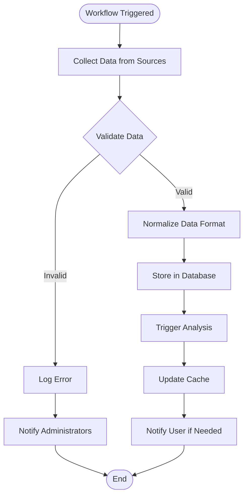
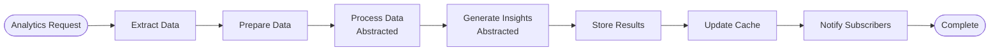
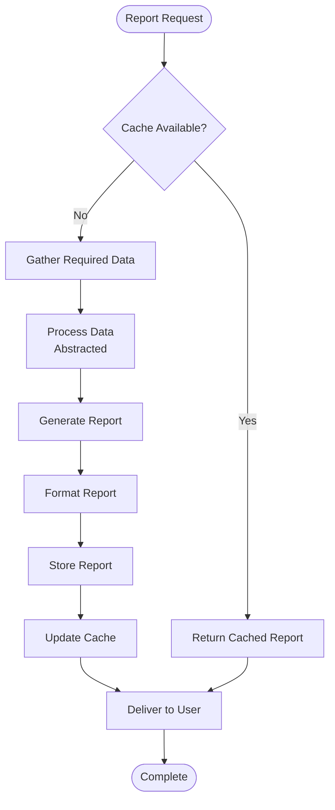
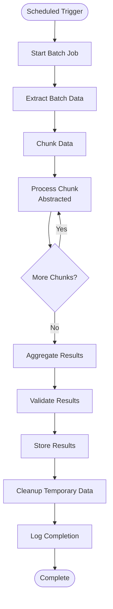
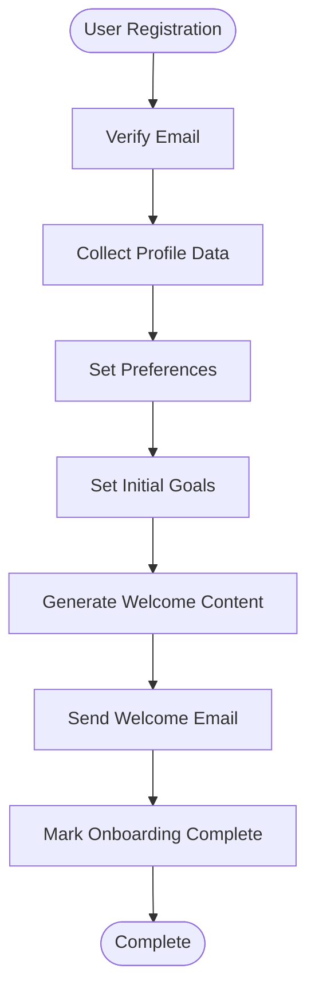
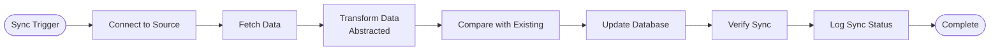
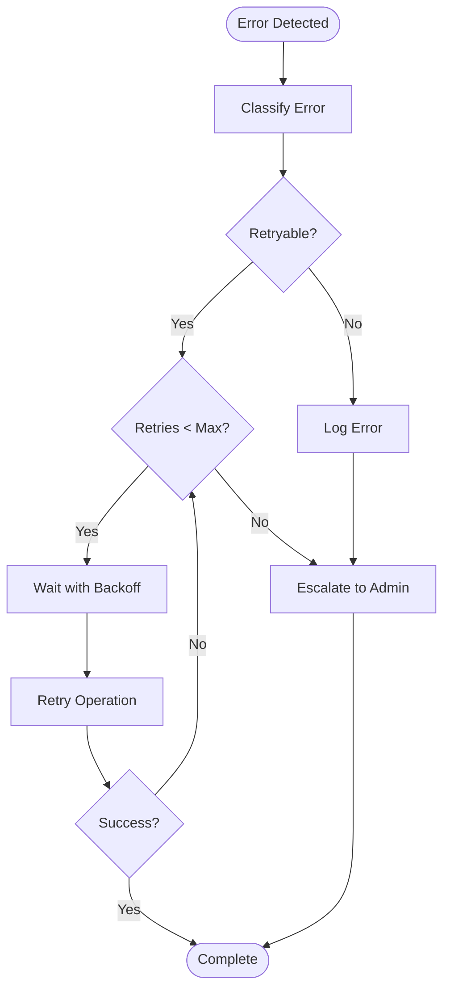

# Automated Workflow Orchestration

This document provides examples of automated workflow patterns used in the platform. All proprietary algorithms, scoring mechanisms, and business logic are abstracted to protect trade secrets.

## Workflow Overview

The platform uses automated workflows to orchestrate complex business processes, data processing, and user interactions. Workflows are designed to be reliable, scalable, and maintainable.

## Workflow Patterns

### Pattern 1: Data Collection & Processing Workflow

**Purpose**: Automatically collect, validate, and process incoming data from multiple sources.



**Key Steps**:
1. **Collect**: Gather data from configured sources
2. **Validate**: Check data quality and completeness
3. **Normalize**: Standardize data format
4. **Store**: Persist to database
5. **Trigger Analysis**: Initiate analytics processing
6. **Update Cache**: Refresh cached data
7. **Notify**: Send notifications if required

**Abstracted Components**:
- Validation rules (proprietary)
- Normalization logic (proprietary)
- Analysis triggers (proprietary)

---

### Pattern 2: Analytics Processing Workflow

**Purpose**: Process collected data to generate insights and analytics.



**Key Steps**:
1. **Extract**: Query relevant data from database
2. **Prepare**: Format data for processing
3. **Process**: Apply analytics (abstracted)
4. **Generate**: Create insights (abstracted)
5. **Store**: Save results to database
6. **Update Cache**: Refresh analytics cache
7. **Notify**: Alert interested parties

**Abstracted Components**:
- Processing algorithms (proprietary)
- Insight generation logic (proprietary)
- Scoring mechanisms (proprietary)

---

### Pattern 3: Report Generation Workflow

**Purpose**: Automatically generate reports based on user requests or schedules.



**Key Steps**:
1. **Check Cache**: Look for existing report
2. **Gather Data**: Collect required data from sources
3. **Process**: Apply data processing (abstracted)
4. **Generate**: Create report content
5. **Format**: Apply formatting and styling
6. **Store**: Save report for future access
7. **Cache**: Update cache for performance
8. **Deliver**: Send report to user

**Abstracted Components**:
- Data processing methods (proprietary)
- Report generation algorithms (proprietary)

---

### Pattern 4: Scheduled Batch Processing Workflow

**Purpose**: Process large volumes of data on a scheduled basis.



**Key Steps**:
1. **Start Batch**: Initialize batch processing job
2. **Extract**: Query batch data from database
3. **Chunk**: Divide data into manageable chunks
4. **Process**: Process each chunk (abstracted)
5. **Aggregate**: Combine chunk results
6. **Validate**: Verify result integrity
7. **Store**: Persist final results
8. **Cleanup**: Remove temporary data
9. **Log**: Record completion status

**Abstracted Components**:
- Chunking strategy (proprietary)
- Processing algorithms (proprietary)
- Aggregation methods (proprietary)

---

### Pattern 5: User Onboarding Workflow

**Purpose**: Guide new users through the onboarding process.



**Key Steps**:
1. **Verify Email**: Confirm email address
2. **Collect Profile**: Gather user profile information
3. **Set Preferences**: Configure user preferences
4. **Set Goals**: Establish initial wellness goals
5. **Generate Welcome**: Create personalized welcome content
6. **Send Welcome**: Deliver welcome communication
7. **Complete**: Mark onboarding as finished

---

### Pattern 6: Data Synchronization Workflow

**Purpose**: Synchronize data between external sources and internal database.



**Key Steps**:
1. **Connect**: Establish connection to external source
2. **Fetch**: Retrieve data from source
3. **Transform**: Convert to internal format (abstracted)
4. **Compare**: Check against existing data
5. **Update**: Apply changes to database
6. **Verify**: Confirm sync success
7. **Log**: Record sync operation

**Abstracted Components**:
- Transformation logic (proprietary)
- Comparison algorithms (proprietary)

---

### Pattern 7: Error Recovery Workflow

**Purpose**: Handle errors gracefully and recover from failures.



**Key Steps**:
1. **Classify**: Determine error type
2. **Check Retryability**: Decide if retry is appropriate
3. **Retry with Backoff**: Attempt retry with exponential backoff
4. **Check Success**: Verify if retry succeeded
5. **Escalate**: Notify administrators if needed
6. **Log**: Record error details

---

## Workflow Orchestration Tools

### Scheduling
- **Cron Jobs**: For time-based scheduling
- **Event Triggers**: For event-driven workflows
- **Manual Triggers**: For on-demand execution

### State Management
- **Workflow State**: Track workflow progress
- **Checkpointing**: Save progress for recovery
- **Resume Capability**: Continue from last checkpoint

### Monitoring
- **Execution Logs**: Track workflow execution
- **Performance Metrics**: Monitor workflow performance
- **Error Tracking**: Capture and analyze errors

### Notifications
- **Success Notifications**: Alert on successful completion
- **Error Notifications**: Alert on failures
- **Progress Updates**: Provide status updates

---

## Workflow Best Practices

### 1. Idempotency
- Workflows should be idempotent where possible
- Safe to retry without side effects
- Use unique identifiers for operations

### 2. Error Handling
- Comprehensive error handling at each step
- Graceful degradation when possible
- Clear error messages and logging

### 3. Performance
- Optimize for efficiency
- Use caching where appropriate
- Parallel processing when possible

### 4. Scalability
- Design for horizontal scaling
- Stateless workflows where possible
- Resource-efficient processing

### 5. Maintainability
- Clear workflow documentation
- Modular workflow components
- Easy to modify and extend

---

## Example Workflow Configurations

### Daily Analytics Processing
```yaml
workflow:
  name: daily-analytics
  schedule: "0 2 * * *"  # 2 AM daily
  steps:
    - extract_data
    - process_analytics
    - generate_reports
    - update_cache
    - send_notifications
```

### Real-Time Data Sync
```yaml
workflow:
  name: realtime-sync
  trigger: event
  event: data_updated
  steps:
    - validate_data
    - update_database
    - invalidate_cache
    - notify_subscribers
```

### Weekly Report Generation
```yaml
workflow:
  name: weekly-reports
  schedule: "0 9 * * 1"  # 9 AM every Monday
  steps:
    - gather_weekly_data
    - generate_reports
    - format_reports
    - deliver_reports
```

---

**Last Updated**: 2025-01-XX
**Status**: Active Development

**Note**: All workflow examples are abstracted to protect proprietary algorithms, business logic, and processing methods. Specific implementation details, scoring mechanisms, and computation logic are not disclosed.
